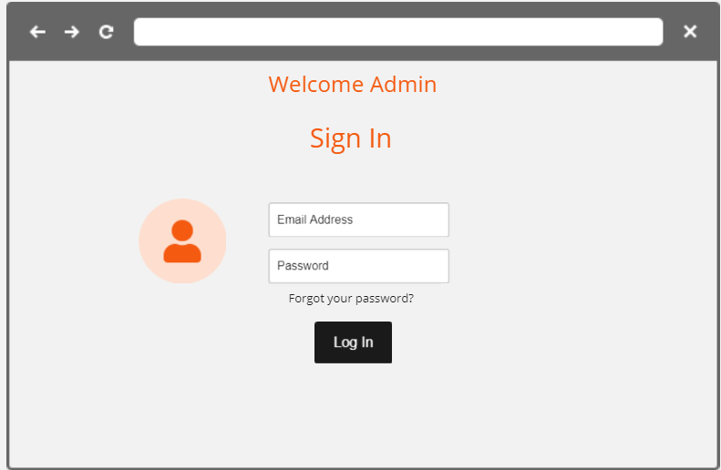
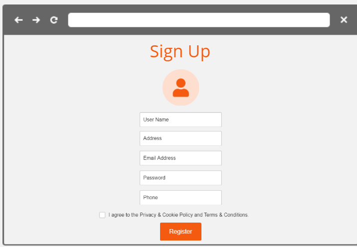
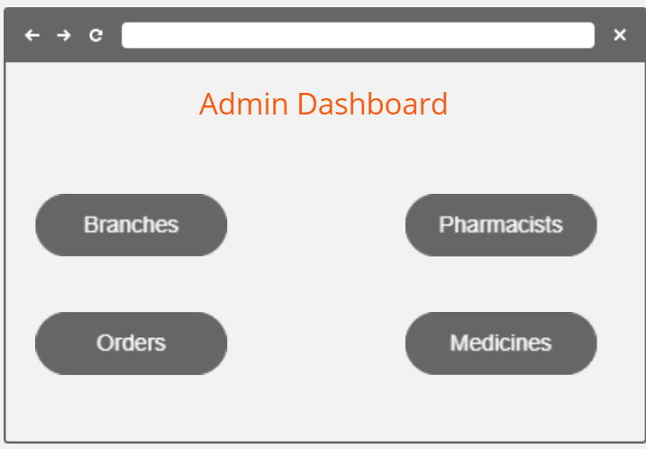
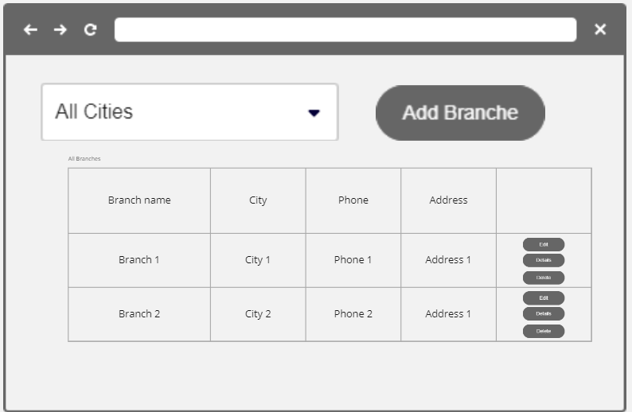
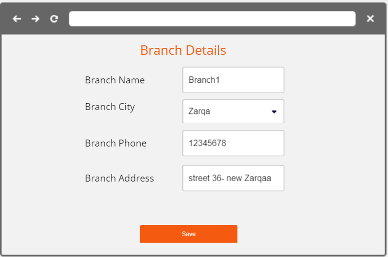
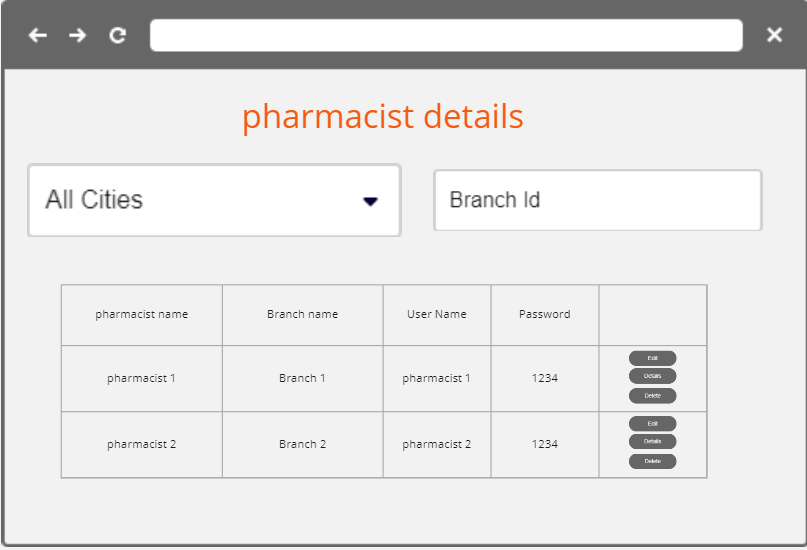
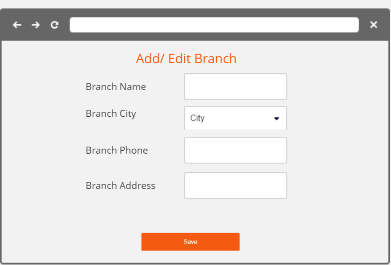
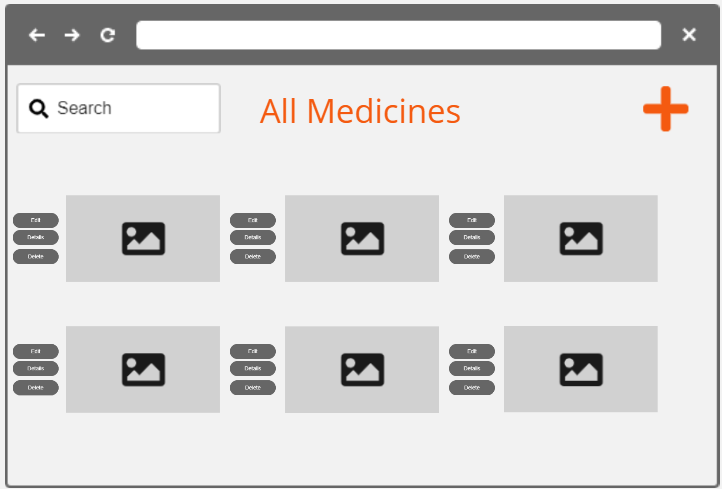
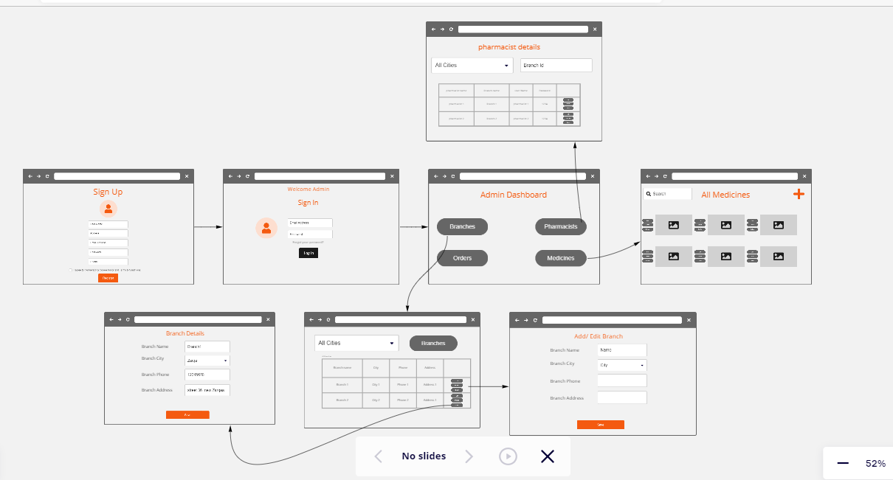
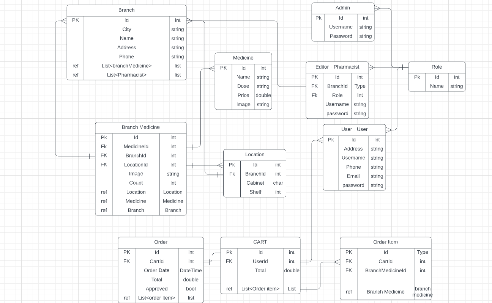

# AUTO-PHARMA-MANAGEMENT-SYSTEM
## Team members
- Hanan Saadeh
- Shadi Aslan (Team Leader)
- Waseem Abuameer
- Yousef Samara
## Introduction
Auto-Pharma is a Pharmacy Management System aims to help in managing their inventory store by improving efficiency, accuracy, and security, allow users (patients) to search for the medicines they need, Confirming the availability of this medicine in the Specific branch, and if not available, suggest the branches that own this drug.

Pharmacies need to maintain details of medicine stock, any stock purchased by the pharmacy and any sales made by the pharmacy.The previous manual methods require the pharmacists to manually monitor all the records lists and transactions and to verify the presence of each drug in the pharmacy. Searching for any required drug may be difficult.

Using the Pharmacy Management System, one can maintain inventory, oversee transactions, and maintains the selling operation. The system will help prevent waste of time and resources, allow easy access to medicines, as well as ensure more security and reliability for the data compared to the manual systems. The system assists the pharmacy in handling the daily requirements in a smoother, better and effective manner.

## Problem Domain

As time moves on, it became necessary to automate systems that people use on daily basis to save effort & time and also reduce human error, Based on this, we decided to design a system that could benefit pharmacies & their customers to make the process of locating medicine simple & easy.
Users could browse the website, indicating what region they wish to shop in & what specific medicines they're looking for, Our server will receive this request and respond with a list of branches near said consumer that have the medicines in question.
Pharmacists could also benefit from our system by organizing medicines into virtual cabinets & shelves in the database that correspond to the cabinets & shelves in the branch which the pharmacist work in, This will give us the ability to search for a specific medicine & locate it in the pharmacy quickly without having to look for it. 

## Wireframes
- Login Page  

- SignUp Page  

- Admin Dashboard Page  

- Branches List Page  

- Branch Details Page  

- pharmaciest Details Page  

- Add/Edit Branch Page  

- Medicines List Page  

## Work Flow

## Domain Modeling

## Functionalties

1- Authentication

a- new user, should follow some validation rules to complete registration, and provide real data to be communicated.

b- logged in user, can be able to search for specific medicine in a specific Pharmacy or in any Pharmacys in the city, then add product to special cart it's just for authenticated users, each user will have own cart and take it frome the 
Pharmacy that he have ordered the medicine from .

c- logged in users can be able to reset password by providing email and new password.

2- Cart

the user can add the medicines he wants to it then he can make Reservation From the pharmacy that he wants to bick it from.

3- Category

a- each medicine will belong to specific medicine shelf, so the pharmacist will be able to see where exactly in which shelf.

b- and how many left from it.

c- and the expiry date for the medicine.

d- portion that the user takes from the medicine

4- PaymentType 

will be only cash in the Pharmacy when the user go and get the Reservation medicines that he did in the website.

5- search bar

a- search bar for the user for used to search for the medicine he wants and in with Pharmacy he can fined it in.

b- search bar for the Pharmacist to now where the medicine are in his Pharmacy in whith medicine shelf number its belong and exact number of how many medicines left in the Pharmacy .

6- adding and deleting property

a- give the Pharmacist the ability to add a new medicine to the Pharmacy.

b- give the Pharmacist the ability to decrease the medicint number with every sale he does.

## User Stories

1. As a new user, I want to register by creating a username and password so that the system can remember me and my data, I should have a valid username and password to meet validation rules by the web application, and keep trying to fix register issues if occur until all validations take place.
2. As a registered user, I want to be able to securely log in to the system so that my information can only be accessed by me. the system can authenticate me and I can trust it.
3. As a registered user, I want to be able to see details of all the medicines available in all the branches with the price.
4. As a registered user, I need to search for a list of medicines in a specific city, and the website will respond with branches containing my request to be  
be able to make a reservation for them and pick them up from the pharmacy.
 

5. As a registered Pharmacist, I need to search for medicines, so that I can find their locations in my branch cabinets.
6. As a registered Pharmacist, I need to have the ability to edit the stock of medicines in my branch.
7. As a registered Pharmacist, I should only be able to edit the branch I work in.
 

8. As an adminstrator, I need to have the ability to Move pharmacists between branches.
9. As an adminstrator, I need to have the ability to Add new medicines to my medicine data base.
10. As an adminstrator, I need to have the ability to make some medicines available in specific branches.
